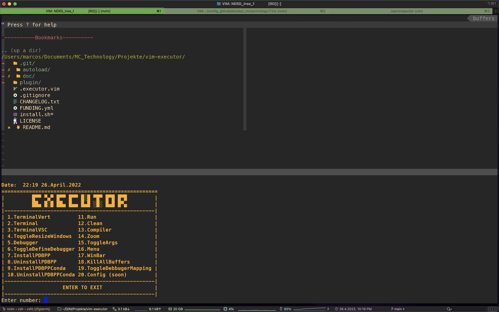
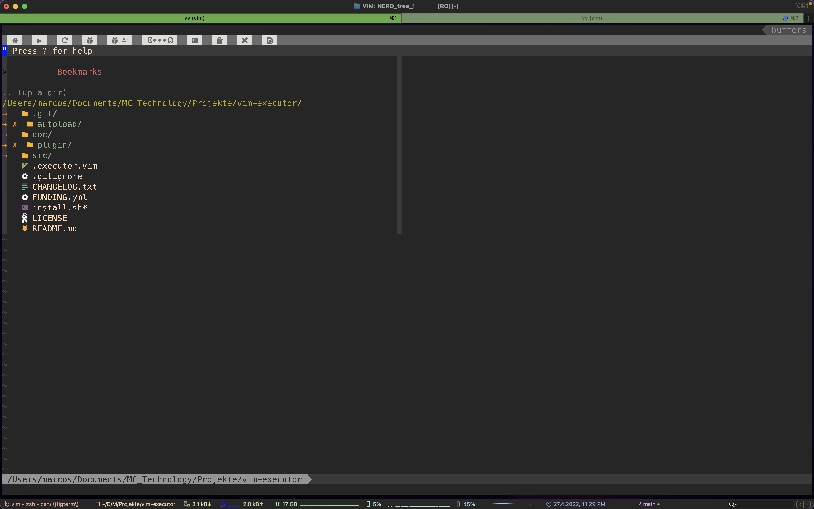

[](https://www.youtube.com/channel/UC_mYh5PYPHBJ5YYUj8AIkcw)

<div align="center">

  [][youtube]
  [][twitter]
  [][instagram]
  [][facebook]
  [][reddit]

</div>
<br>


[Intro](#Intro) | [Installation](#Installation) | [Donate](#Donate) | [LICENSE](#LICENSE)

----
# This is the alpha version of the plugin, I'm still developing it, detecting bugs and fixing errors. IF YOU HAVE PROBLEM BECAUSE THE PLUGIN IS NOT STABLE, PLEASE UNINSTALL IT AND WAIT FOR A STABLE VERSION TO BE RELEASED.

# Intro
`executor` multilanguage code executor for vim. Run, compile, clean, debug
and more with just 1 click!

tmux, run code, debugger and more all in one place with native vim!

Compatibility:
```bash
python,sh,r,c,cpp,markdown,css,html,javascript # for now
```

# Installation

#### Quick start
Simply install the plugin with your preferred plugin handler
and the arguments for the following variables in your `.vimrc`

```vim
" install executor with Plug
Plug 'mctechnology17/vim-executor'
" you can use all executor functions without dependencies, but if
" you want latex preview, markdown, html, css and javascript you need
" to install these additional plugins!

" make sure you have pdflatex installed (soon pandoc support)
Plug 'xuhdev/vim-latex-live-preview', { 'for': 'tex' }
" make sure you have yarn installed
Plug 'iamcco/markdown-preview.nvim', { 'do': 'cd app && yarn install'  }
" for html,css,javascript
Plug 'turbio/bracey.vim', {'do': 'npm install --prefix server'}

" refresh the sources or close vim and go back in and run the command
:PlugInstall

" set your config, hier a example(I recom to use the defauld):
set wildmode=list:longest,list:full
set wildmenu
set wildignore+=*.o,*.obj,.git,*.rbc,*.pyc,__pycache__
set wildignore+=*/tmp/*,*.so,*.swp,*.zip,*.pyc,*.db,*.sqlite,*.DS_Store
" if you use zsh
if executable( 'zsh' ) | set shell=zsh | endif
let g:executor_compiler_run_code = 0
" 0 = deactivate 1 = <ESC> 2 = <ESC><ESC>
let g:executor_esc = 2
" 1 = <S-ARROWS> 2 = <LEADER><ARROWS> 3 = <C-HJKL>
let g:executor_jump = 1
nnoremap <Leader>v :ExecutorTerminalVert<CR>
nnoremap <Leader>x :ExecutorTerminalVSC<CR>
nnoremap <Leader>X :ExecutorTerminal<CR>
nnoremap ++ :ExecutorResizeWindows<CR>
nnoremap <Leader>k :ExecutorKillAllBuffers<CR>
nnoremap <silent> <TAB>+ :ExecutorDebugger<CR>
nnoremap <Leader>- :ExecutorToggleArgs<CR>
nnoremap <Leader>p :ExecutorRun<CR>
nnoremap <Leader>+ :ExecutorCompiler<CR>
nnoremap <Leader>c :ExecutorClean<CR>
nnoremap <Leader>m :ExecutorZoom<CR>
noremap -m :ExecutorMenu<CR>
noremap -d :ExecutorToggleDebuggerMapping<CR>
```
Hier -> [.executor.vim](.executor.vim) you can see the default configuration, so you can orient yourself in your vimrc

[//]: # (   )

#### Interactive menu with dialer


#### Run, compile, clean, debug and more with just 1 click!



#### Manuaal installation
If you are not using any plug manager, you can integrate GitManager to
vim in the following way, keeping in mind that the repository is in your home

```vim
    set rtp+=~/vim-executor
```

#### Using [Vundle](https://github.com/gmarik/vundle):

Just add this line to your `~/.vimrc`:

```vim
Plugin 'mctechnology17/vim-executor'
```
And run `:PluginInstall` inside Vim.

#### Using [pathogen.vim](https://github.com/tpope/vim-pathogen):

Copy and paste in your shell:

```bash
cd ~/.vim/bundle
git clone https://github.com/mctechnology17/vim-executor
```

#### Using [vpm](https://github.com/KevinSjoberg/vpm):

Run this command in your shell:

```bash
vpm insert mctechnology17/vim-executor
```

#### Using [Plug](https://github.com/junegunn/vim-plug):

Just add this line to your `~/.vimrc` inside plug call:

```vim
Plug 'mctechnology17/vim-executor'
```

And run `:PlugInstall` inside Vim or `vim +PlugInstall +qa` from shell.


# Donate
If you're enjoy my work, feel free to donate or become a sponsor.
- [paypal]
- [sponsor]

Ambassador and creator/maintainer of vimtools, GitManager and more,
that are easy to integrate, but very powerful work tools that allow you to
improve your workflow, integrating with all operating systems and all
possible shells.

Here you can see another recently published project:
- [vimtools] swiss army knife for vim (functions and settings that will make it easy for you life)
- [gm] manager for GIT multi platform with a friendly user interface
- [vim-better-header] better automated template
- [vim-executor] multilanguage code executor.


# [LICENSE](LICENSE)

Released under the GNU General Public License v3.0.

Copyright (c) 2022 Marcos Chow Castro

# TODO
- [  ] add support for other languages
- [  ] add support for other shells
- [  ] add support for other operatings systems
- [  ] add support for other plugins
- [  ] complete the documentation
- [  ] logs

[twitter]: https://twitter.com/mctechnology17
[youtube]: https://www.youtube.com/c/mctechnology17
[instagram]: https://www.instagram.com/mctechnology17/
[facebook]: https://m.facebook.com/mctechnology17/
[reddit]:https://www.reddit.com/user/mctechnology17

[vim-executor]: https://github.com/mctechnology17/vim-executor
[vim-better-header]: https://github.com/mctechnology17/vim-better-header
[gm]: https://github.com/mctechnology17/gm
[vimtools]: https://github.com/mctechnology17/vimtools
[jailbreakrepo]: https://mctechnology17.github.io/
[uiglitch]: https://repo.packix.com/package/com.mctechnology.uiglitch/
[uiswitches]: https://repo.packix.com/package/com.mctechnology.uiswitches/
[uibadge]: https://repo.packix.com/package/com.mctechnology.uibadge/
[youtuberepo]: https://github.com/mctechnology17/youtube_repo_mc_technology
[sponsor]: https://github.com/sponsors/mctechnology17
[paypal]: https://www.paypal.me/mctechnology17
[readline]: https://github.com/PowerShell/PSReadLine/blob/master/README.md
