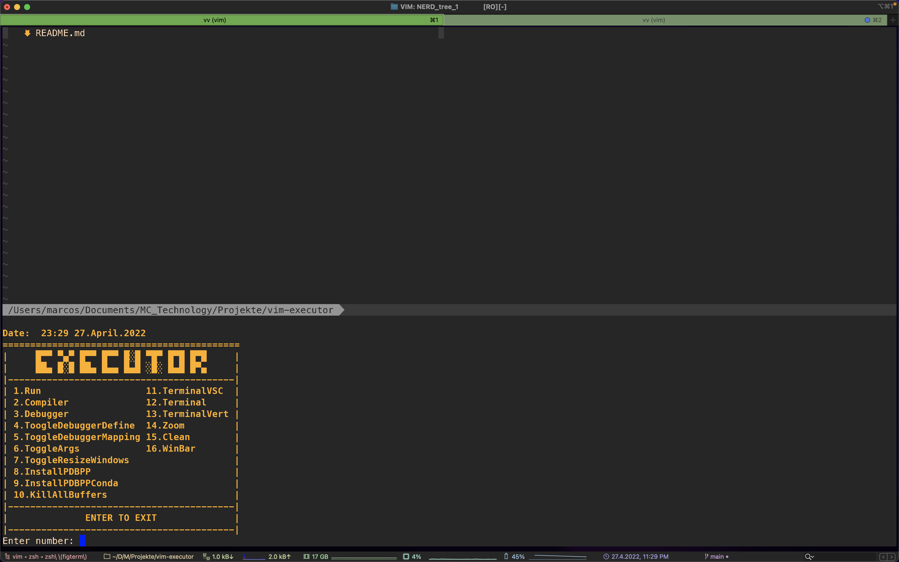

[](https://www.youtube.com/channel/UC_mYh5PYPHBJ5YYUj8AIkcw)

<div align="center">

  [][youtube]
  [][twitter]
  [][instagram]
  [][facebook]
  [][reddit]

</div>
<br>


[Intro](#Intro) | [Installation](#Installation) | [Donate](#Donate) | [LICENSE](#LICENSE)

----

# Intro
`executor` multilanguage code executor for vim. Run, compile, clean, debug
and more with just 1 click!

tmux, code run, debugger and more all in one place with native vim!

Compatibility:
```bash
python,sh,r,c,cpp,markdown,css,html,javascript # for now
```

# Installation

#### Quick start
Simply install the plugin with your preferred plugin handler
and the arguments for the following variables in your `.vimrc`

```vim
" install executor with Plug
Plug 'mctechnology17/vim-executor'
" refresh the sources or close vim and go back in and run the command
:PlugInstall

" set your config, hier a example(I recom to use the defauld):
set wildmode=list:longest,list:full
set wildmenu
set wildignore+=*.o,*.obj,.git,*.rbc,*.pyc,__pycache__
set wildignore+=*/tmp/*,*.so,*.swp,*.zip,*.pyc,*.db,*.sqlite,*.DS_Store
" if you use zsh
if executable( 'zsh' ) | set shell=zsh | endif
let g:executor_compiler_run_code = 0
" 0 = deactivate 1 = <ESC> 2 = <ESC><ESC>
let g:executor_esc = 2
" 1 = <S-ARROWS> 2 = <LEADER><ARROWS> 3 = <C-HJKL>
let g:executor_jump = 1
" open a vertical terminal
nnoremap <Leader>v :ExecutorTerminalVert<CR>
" pen a terminal with size proportional to the vscode terminal
nnoremap <Leader>x :ExecutorTerminalVSC<CR>
" open a horizontal terminal
nnoremap <Leader>X :ExecutorTerminal<CR>
" toggle to resize windows
nnoremap ++ :ExecutorResizeWindows<CR>
" kill all buffers and keep the current buffer
nnoremap <Leader>k :ExecutorKillAllBuffers<CR>
" call debugger
nnoremap <silent> <TAB>+ :ExecutorDebugger<CR>
" on/off argument input
nnoremap <Leader>- :ExecutorToggleArgs<CR>
" run the code like run code for VS Code
nnoremap <Leader>p :ExecutorRun<CR>
" compile the code
nnoremap <Leader>+ :ExecutorCompiler<CR>
" clean object files: main.o, main.exe, pdf, __pycache__ etc
nnoremap <Leader>c :ExecutorClean<CR>
" zoom in the current window/buffer
nnoremap <Leader>m :ExecutorZoom<CR>
" call a menu
noremap -x :ExecutorMenu<CR>
" execute a command in the current directory (e.g. make test...)
noremap -c :ExecutorCommand<CR>
" debugger mapping: 0.UNMAP 1.gdb(soon) 2.lldb(soon) 3.pdb 4.vimspector
noremap -d :ExecutorToggleDebuggerMapping<CR>
```

# Add complements
You can use all executor functions without dependencies, but if
you want latex preview, markdown, html, css and javascript you need
to install these additional plugins!

```vim
" make sure you have pdflatex installed (soon pandoc support)
Plug 'xuhdev/vim-latex-live-preview', { 'for': 'tex' }
" make sure you have yarn installed
Plug 'iamcco/markdown-preview.nvim', { 'do': 'cd app && yarn install'  }
" for html,css,javascript
Plug 'turbio/bracey.vim', {'do': 'npm install --prefix server'}
```

# Hier you can see the default configuration
Please feel free to change what suits you best!

```vim
""" MAPPING:
" 1 = <ESC> 2 = <ESC><ESC> time to exit the terminal and enter normal mode
let g:executor_esc =
      \ get(g:, 'executor_esc', 2)
" 1 = <S-ARROWS> 2 = <LEADER><ARROWS> 3 = <C-HJKL>
let g:executor_jump =
      \ get(g:, 'executor_jump', 1)
" default mapping for various useful functions
" THERE IS NO OPTION TO CONFIGURE.
" map: cd -> change directory
" map: fi -> file identifier
" map: fl -> file list
" map: fs -> find string in all files in current directory
" map: fm -> file maximization
" map: fw -> file write
" map: fo -> file open from current directory
" map: fr -> file rename(curre buffer) like tmux
let g:executor_file_mapping =
      \ get(g:, 'executor_file_mapping', 1)
" activate and deactivate the WinBar. ONLY FOR VIM
let g:executor_winbar =
      \ get(g:, 'executor_winbar', 1)

""" DEBUGGER:
let g:executor_debugger_define =
      \ get(g:, 'executor_debugger_define', 0)
let g:executor_debugger_flags_c =
      \ get(g:, 'executor_debugger_flags_c', '')
let g:executor_debugger_flags_cpp =
      \ get(g:, 'executor_debugger_flags_cpp', '')
let g:executor_debugger_flags_python =
      \ get(g:, 'executor_debugger_flags_python', '-m')
let g:executor_debugger_flags_latex =
      \ get(g:, 'executor_debugger_flags_latex', '')
let g:executor_debugger_flags_r =
      \ get(g:, 'executor_debugger_flags_r', '')
let g:executor_debugger_flags_sh =
      \ get(g:, 'executor_debugger_flags_sh', '')

""" COMPILER:
" always ask if you want to define the debugger
let g:executor_compiler_run_code =
      \ get(g:, 'executor_compiler_run_code', 0)
let g:executor_compiler_flags_c =
      \ get(g:, 'executor_compiler_flags_c',
      \ '-g -v -m64 -Wall -Werror -Wunused-parameter -Wunused-variable -O3 -pedantic')
let g:executor_compiler_flags_cpp =
      \ get(g:, 'executor_compiler_flags_cpp',
      \ '-g -v -m64 -Wall -Werror -Wunused-parameter -Wunused-variable -O3 -pedantic')
let g:executor_compiler_flags_python =
      \ get(g:, 'executor_compiler_flags_python', '')
let g:executor_compiler_flags_latex =
      \ get(g:, 'executor_compiler_flags_latex', '')
let g:executor_compiler_flags_r =
      \ get(g:, 'executor_compiler_flags_r', '--verbose')
let g:executor_compiler_flags_sh =
      \ get(g:, 'executor_compiler_flags_sh', '')

""" ARGUMENTS:
" always ask if you want to define the arguments
let g:executor_input_args =
      \ get(g:, 'executor_input_args', 0)
let g:executor_program_args_c =
      \ get(g:, 'executor_program_args_c', '')
let g:executor_program_args_cpp =
      \ get(g:, 'executor_program_args_cpp', '')
let g:executor_program_args_python =
      \ get(g:, 'executor_program_args_python', '')
let g:executor_program_args_latex =
      \ get(g:, 'executor_program_args_latex', '')
let g:executor_program_args_r =
      \ get(g:, 'executor_program_args_r', '')
let g:executor_program_args_sh =
      \ get(g:, 'executor_program_args_sh', '')

""" COMMAND:
" open a vertical terminal
ExecutorTerminalVert          call executor#OpenTerminalVert()
" open a horizontal terminal
ExecutorTerminal              call executor#OpenTerminal()
" open a terminal with size proportional to the vscode terminal
ExecutorTerminalVSC           call executor#OpenTerminalVSC()
" toggle to resize windows
ExecutorToggleResizeWindows   call executor#ToggleResizeWindows()
" call debugger
ExecutorDebugger              call executor#Debugger()
" define the debugger
ExecutorToggleDefineDebugger  call executor#ToggleDebuggerDefine()
" debugger mapping: 0.UNMAP 1.gdb 2.lldb 3.pdb 4.vimspector
ExecutorToggleDebuggerMapping call executor#ToggleDebuggerMapping()
" Mappgin for pdb option 3
" map: <TAB>u sticky<CR>
" map: <TAB>d run<Space>
" map: <TAB>r restart<Space>
" map: <TAB>q quit<CR>
" map: <TAB>n next<CR>
" map: <TAB>h help<CR>
" map: <TAB>w where<CR>
" map: <TAB>c continue<CR>
" map: <TAB>s step<CR>
" map: <TAB><UP> up<CR>
" map: <TAB><DOWN> down<CR>
" map: <TAB><RIGHT> next<CR>
" map: <TAB><LEFT> reteval<CR>
" map: <TAB>b break<Space>
" map: <TAB>db clear<CR>
" map: <TAB>v jump<CR>
" map: <TAB>e p<Space>
" Mappgin for vimspector option 4
" map: <TAB>d :call vimspector#Launch()<CR>
" map: <TAB>r :call vimspector#Restart()<CR>
" map: <TAB>q :call vimspector#Reset()<CR>
" map: <TAB>n :call vimspector#Continue()<CR>
" map: <TAB><UP> :call vimspector#StepOut()<CR>
" map: <TAB><DOWN> :call vimspector#StepInto()<CR>
" map: <TAB><RIGHT> :call vimspector#StepOver()<CR>
" map: <TAB><LEFT> :call vimspector#AddWatch( expand( '<cexpr>' ) )<CR>
" map: <TAB>dw :call vimspector#DeleteWatch()<CR>
" map: <TAB>b :call vimspector#ToggleBreakpoint()<CR>
" map: <TAB>db :call vimspector#ClearBreakpoints()<CR>
" map: <TAB>v :call vimspector#RunToCursor()<CR>
" map: <TAB>e :<c-u>call vimspector#Evaluate( expand( '<cexpr>' ) )<CR>
" install the debugger pdbpp with pip for python
ExecutorInstallPDBPP          call executor#InstallPDBPP()
" uninstall the debugger pdbpp
ExecutorUninstallPDBPP        call executor#UninstallPDBPP()
" install the debugger pdbpp with conda for python
ExecutorInstallPDBPPConda     call executor#InstallPDBPPConda()
" uninstall the debugger pdbpp
ExecutorUninstallPDBPPConda   call executor#UninstallPDBPPConda()
" run the code
ExecutorRun                   call executor#Run()
" clean object files: main.o, main.exe, pdf, __pycache__ etc
ExecutorClean                 call executor#Clean()
" compile the code
ExecutorCompiler              call executor#Compiler()
" zoom in the current window/buffer
ExecutorZoom                  call executor#Zoom(v:true)
" on/off argument input
ExecutorToggleArgs            call executor#ToggleArgs()
" call a menu
ExecutorMenu                  call executor#Menu()
" call the WinBar
ExecutorWinBar                call executor#WinBar()
" source a local config in your current directory
ExecutorConfig                call executor#Config()
" execute a command in the current directory (e.g. make test...)
ExecutorCommand               call executor#Command()
" kill all buffers and keep the current buffer
ExecutorKillAllBuffers silent! execute "%bd|e#|bd#"

""" WINBAR:
" Winbar defaults. if you want to customize the winbar you can leave the
" corresponding variable for activation at 0, or simply add more options of
" your interest
nnoremenu WinBar.  :call executor#Menu()<CR>
nnoremenu WinBar.▶ :call executor#Run()<CR>
nnoremenu WinBar. :call executor#Compiler()<CR>
nnoremenu WinBar.ﴫ :call executor#Debugger()<CR>
nnoremenu WinBar.ﴫ\  :call executor#ToggleDebuggerDefine()<CR>
nnoremenu WinBar.ᗧ•••ᗣ  :call executor#ToggleArgs()<CR>
nnoremenu WinBar. :call executor#Command()<CR>
nnoremenu WinBar.﯊ :call executor#Clean()<CR>
nnoremenu WinBar. :aunmenu WinBar<CR>
```

#### Interactive menu with dialer


#### Run, compile, clean, debug and more with just 1 click!


#### Manuaal installation
If you are not using any plug manager, you can integrate GitManager to
vim in the following way, keeping in mind that the repository is in your home

```vim
    set rtp+=~/vim-executor
```

#### Using [Vundle](https://github.com/gmarik/vundle):

Just add this line to your `~/.vimrc`:

```vim
Plugin 'mctechnology17/vim-executor'
```
And run `:PluginInstall` inside Vim.

#### Using [pathogen.vim](https://github.com/tpope/vim-pathogen):

Copy and paste in your shell:

```bash
cd ~/.vim/bundle
git clone https://github.com/mctechnology17/vim-executor
```

#### Using [vpm](https://github.com/KevinSjoberg/vpm):

Run this command in your shell:

```bash
vpm insert mctechnology17/vim-executor
```

#### Using [Plug](https://github.com/junegunn/vim-plug):

Just add this line to your `~/.vimrc` inside plug call:

```vim
Plug 'mctechnology17/vim-executor'
```

And run `:PlugInstall` inside Vim or `vim +PlugInstall +qa` from shell.


# Donate
If you're enjoy my work, feel free to donate or become a sponsor.
- [paypal]
- [sponsor]

Ambassador and creator/maintainer of vimtools, GitManager and more,
that are easy to integrate, but very powerful work tools that allow you to
improve your workflow, integrating with all operating systems and all
possible shells.

Here you can see another recently published project:
- [vimtools] swiss army knife for vim (functions and settings that will make it easy for you life)
- [gm] manager for GIT multi platform with a friendly user interface
- [vim-better-header] better automated template
- [vim-executor] multilanguage code executor.


# [LICENSE](LICENSE)

Released under the GNU General Public License v3.0.

Copyright (c) 2022 Marcos Chow Castro

# TODO
- [  ] add support for other languages
- [  ] add support for other shells
- [  ] add support for other operatings systems
- [  ] add support for other plugins
- [  ] complete the documentation
- [  ] logs
- [  ] acknowledgments and references

[twitter]: https://twitter.com/mctechnology17
[youtube]: https://www.youtube.com/c/mctechnology17
[instagram]: https://www.instagram.com/mctechnology17/
[facebook]: https://m.facebook.com/mctechnology17/
[reddit]:https://www.reddit.com/user/mctechnology17

[vim-executor]: https://github.com/mctechnology17/vim-executor
[vim-better-header]: https://github.com/mctechnology17/vim-better-header
[gm]: https://github.com/mctechnology17/gm
[vimtools]: https://github.com/mctechnology17/vimtools
[jailbreakrepo]: https://mctechnology17.github.io/
[uiglitch]: https://repo.packix.com/package/com.mctechnology.uiglitch/
[uiswitches]: https://repo.packix.com/package/com.mctechnology.uiswitches/
[uibadge]: https://repo.packix.com/package/com.mctechnology.uibadge/
[youtuberepo]: https://github.com/mctechnology17/youtube_repo_mc_technology
[sponsor]: https://github.com/sponsors/mctechnology17
[paypal]: https://www.paypal.me/mctechnology17
[readline]: https://github.com/PowerShell/PSReadLine/blob/master/README.md
